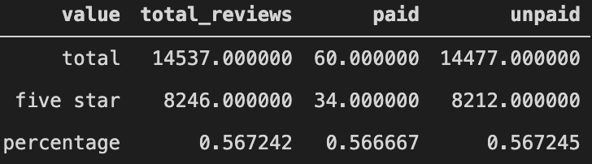

# Amazon_Vine_Analysis

## Overview

The purpose of this analysis was to see if any bias is introduced in product reviewing with Amazon's Vine reviewing program. I chose the musical instrument data set which includes products like pianos and guitars as well as microphones and other music equipment.

## Results

## Summary

